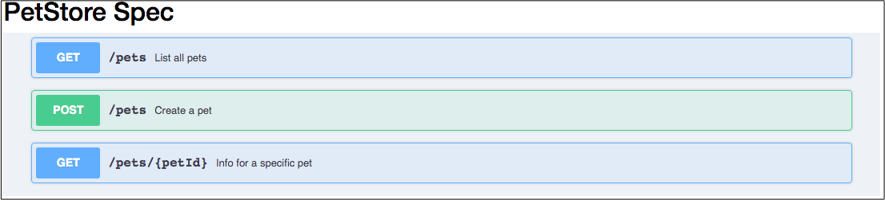

sphinxcontrib-swaggerui
#######################

.. image:: https://travis-ci.org/sphinx-contrib/sphinxcontrib-swaggerui.svg?branch=master
   :target: https://travis-ci.org/sphinx-contrib/sphinxcontrib-swaggerui

Provides the ``swaggerui`` directive for reST files to build a driven
by `Swagger-UI <https://swagger.io/tools/swagger-ui/>`_ interactive panel presenting
your `OpenAPI <https://swagger.io/resources/open-api>`_ specification document.

Overview
========

This Sphinx extension is necessary for those who publish an interactive document presenting their API specification
compliant with OpenAPI and want to use the well-known Swagger-UI tool for this purpose.
The ``swaggerui`` directive enables you to embed such interactive panel in an arbitrary place of a reST file.

Sphinx Directive swaggerui
==========================

Installation
------------

.. code-block:: text

   $ pip install sphinxcontrib-swaggerui

Configuration
-------------

In your Sphinx project configuration file ``conf.py``, add the installed extension::

    extensions = [...,
        'sphinxcontrib.swaggerui',
        ...]

The directive also implies that you use the static content in the **_static/** folder and this is configured as::

    html_static_path = ['_static']

Directive in reST Files
-----------------------

Use the following sample configuration (containing all possible options) when testing the directive for the first time::

    .. swaggerui:: ../_static/swaggerui/petstore.yaml                                  # *) Required
       :url: https://unpkg.com/swagger-ui-dist@3/swagger-ui-bundle.js                  # *) Required
       :css: ../_static/swaggerui/swagger-ui.css                                       # *) Required
       :script: https://unpkg.com/swagger-ui-dist@3/swagger-ui-standalone-preset.js    # Optional
       :filter: pets                                                                   # Optional

An attribute (for example, ``../_static/swagger/petstore.yaml``) refers to your local YAML or JSON file in
the OpenAPI format. The path must be relative to the document containing the directive.

The directive uses the following options:

*  ``url`` refers to a CDN-based (Content Delivery Network) Swagger-UI package. For a proper version of the script, refer
   to the `UNPKG <https://unpkg.com/browse/swagger-ui-dist/>`_ CDN. The script name must be ``swagger-ui-bundle.js``.
*  ``css`` refers to a local Swagger-UI CSS file. The path must be relative to the document containing the directive.
   You can find a proper CSS file in the `UNPKG <https://unpkg.com/browse/swagger-ui-dist/>`_ CDN.
*  ``script`` refers to an additional script (the one in the above example is recommended). For a proper version of
   the script, refer to the `UNPKG <https://unpkg.com/browse/swagger-ui-dist/>`_ CDN. The script name must
   be ``swagger-ui-standalone-preset.js``. Probably, you will find another script that can work with the main
   Swagger-UI script specified by the ``:url:`` option.
*   ``filter`` requires Swagger UI to display only those endpoints (paths) which contain a tag that partially or fully
    matches the filter.

.. note::

   1. This package contains ``petstore.yaml`` and ``swagger-ui.css`` files (mentioned in the above example)
      copied to the ``_static/swaggerui/`` folder during the first use of the directive by Sphinx.
      So don't care about copying these files when you specify the relative path to that folder; the sample files
      will appear automatically in it whether you use them or not.

   2. You will probably need to edit the CSS styles using your own CSS files.

Sample CSS Customization
========================

Avoid the operation block tag to disappear::

   h4.opblock-tag a.nostyle {
      opacity: 1
   }

Remove the Swagger top-bar::

   .swagger-ui .topbar {
      display: none;
   }

More complex customization that removes all headers leaving only the list of operations: GET, PUT, etc. - and
does some other makeups::

   /* Editing Swagger UI styles */

   .topbar, .information-container, .scheme-container, .operation-filter-input, .try-out, .response-controls, .opblock-tag {
      display: none!important;
   }

   .swagger-ui .response-col_description {
      width: 75%!important;
   }

   .swagger-ui .response-col_links {
      max-width: 100em;
   }

   .swagger-ui.swagger-container {
      padding-top: 5px;
      background-color: #EEF1F6;
   }

This is how a section looks like with the above CSS:

Links
=====

- Source: `Bitbucket <https://bitbucket.org/albert_bagdasaryan/sphinxcontrib-swaggerui/>`_

.. commented:

   - Bugs and issues: `Issues <https://github.com/sphinx-contrib/sphinxcontrib-swaggerui/issues>`_
